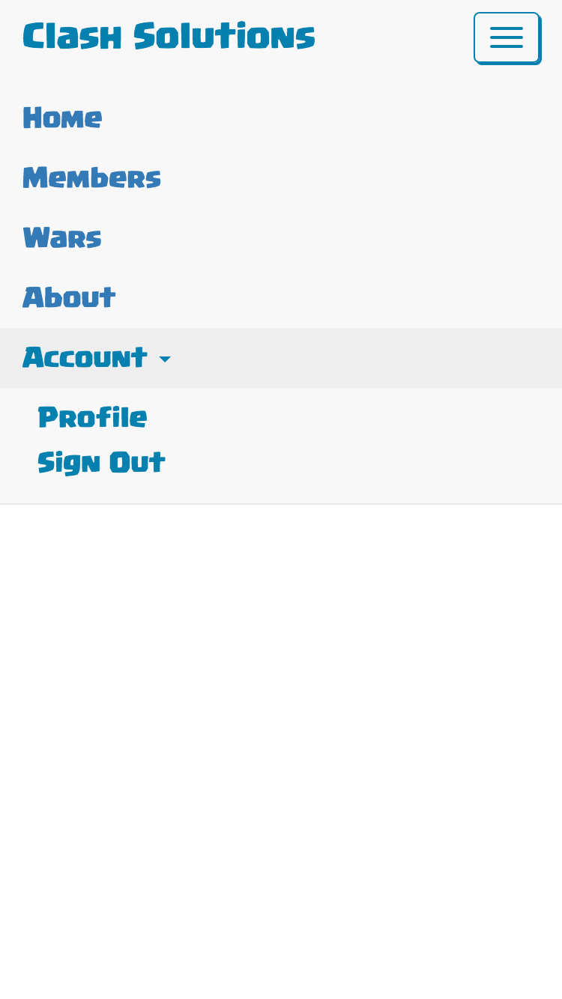

# clash_tool
This application began as a passionate side project that would force me to learn the MEAN stack. It was successful in teaching me the MEAN stack, however I lost interest in the underlying game this application was meant to support, and subsequently lost interest in developing it. I thought I could finish it up so anyone could pick up where I left off -- and add features -- but due to the learning curve of web-dev this application is half beginner-style and half intermediate-style. The code is a mess largely due to the fact that I started knowing nothing, and worked my way to a pretty good understanding of the MEAN stack. Also, it is around this time that ES6 came out, and so I started using ES6 constructs and other places I was not.

So to conclude: this application is a mess of bad programming and half-built features. I should have picked a smaller project as my first "learning experience." At this point I would rather 1) start a new MEAN stack application with good programming habits throughout, or 2) learn a new technology such as React.js to expand my knowledge and understanding of Web-Dev. The only way to save this project would be if I received external interest in this project, and help from someone willing to dedicate time to such a cause. And in all honesty, I would likely start over. It's a sad reality to what is >8 months of my free time, but as the logical fallacy goes: If you walk halfway to the store and then realize you forgot your wallet, it does not make sense to walk the rest of the way because you have already dedicated time in to walking the first half. Some times you have to know when to walk away, and this is that time.

Also, here are some photos of the application while it was still up. It was even live for a short time and had some users, but I overcommitted and now the application is no longer.

